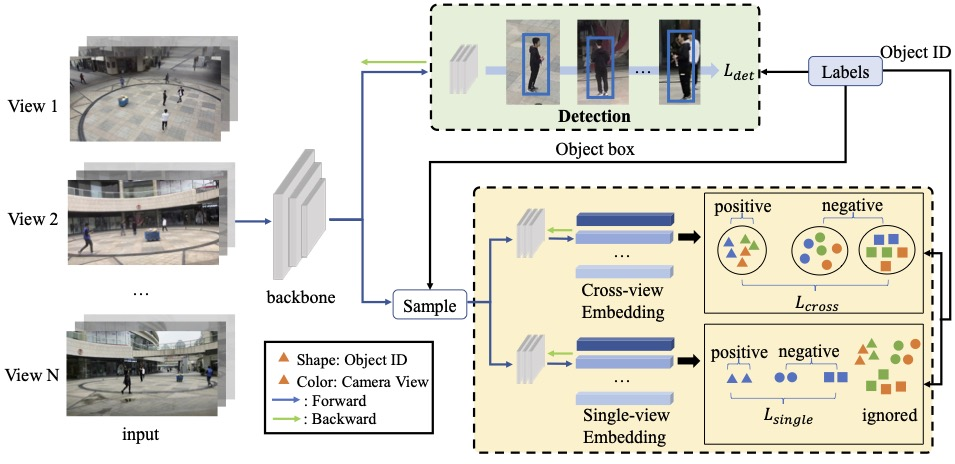

# CrossMOT

## Framework


## Installation
* Install dependencies. We use python 3.8 and pytorch >= 1.7.0
```
conda create -n CrossMOT python=3.8
conda activate CrossMOT
conda install pytorch==1.7.0 torchvision==0.8.0 cudatoolkit=10.2 -c pytorch
cd ${CrossMOT_ROOT}
pip install cython
pip install -r requirements.txt
```
* We use [DCNv2_pytorch_1.7](https://github.com/ifzhang/DCNv2/tree/pytorch_1.7) in our backbone network (pytorch_1.7 branch). Previous versions can be found in [DCNv2](https://github.com/CharlesShang/DCNv2).
```
git clone -b pytorch_1.7 https://github.com/ifzhang/DCNv2.git
cd DCNv2
./make.sh
```

## Data preparation

* We use three cross-view MOT datasets: [DIVOTrack](https://github.com/shengyuhao/DIVOTrack), [MvMHAT](https://github.com/realgump/MvMHAT) and [CAMPUS](http://web.cs.ucla.edu/~yuanluxu/research/mv_track.html). You can go to their official website to download the images and annotations. After download the datasets, please put the all the image in ${CrossMOT_root}/dataset/dataset_name/images. Notice that the name of each image should have the format "{scene_name}\_{view_name}_{frame_id}.jpg". Then you need to use the annotation file and ${CrossMOT_root}/src/dataset_util/ to generate the corresponding labels and store in \${CrossMOT_root}/dataset/dataset_name/labels_with_ids. 
* Before training, the dataset should have the following format

```
${dataset_name}
   |——————images
   |        └——————train
   └——————labels_with_ids
   |         └——————train
   |         └——————test
```


## Pretrained model
* **Pretrained model**\
We use the prertained model of [FairMOT](https://github.com/ifzhang/FairMOT) The models can be downloaded here: fairmot_dla34.pth [[Google]](https://drive.google.com/file/d/1iqRQjsG9BawIl8SlFomMg5iwkb6nqSpi/view?usp=sharing) [[Baidu, code:uouv]](https://pan.baidu.com/s/1H1Zp8wrTKDk20_DSPAeEkg) [[Onedrive]](https://microsoftapc-my.sharepoint.com/:u:/g/personal/v-yifzha_microsoft_com/EWHN_RQA08BDoEce_qFW-ogBNUsb0jnxG3pNS3DJ7I8NmQ?e=p0Pul1).

After downloading, you should put the baseline model in the following structure:
```
${CrossMOT_ROOT}
   └——————models
           └——————fairmot_dla34.pth
```

## Training
* Download the training data
* Change the dataset root directory 'root' in src/lib/cfg/data.json and 'data_dir' in src/lib/opts.py
* Run the following command

### Train DIVOTrack
```
sh ./experiments/train_divo.sh
```

### Train MvMHAT
```
sh ./experiments/train_mvmhat.sh
```
### Train Campus
```
sh ./experiments/train_campus.sh
```
## Tracking
* For tracking, you only need to specify the tracking model by running the following command
```
cd src
python track.py mot --load_model {your path to the tracking model} --test_divo --conf_thres 0.5 --reid_dim 512 --track_name {your exp name}
```

## Ablation Study 
* You can modify the training or tracking setting to reproduce our ablation setting, the instruction is as follows:

### Train
```
--baseline  
# if you set baseline equals to 1, this is our share embedding experiment, you need tio further specify --baseline_view: 0 for single-view embedding, 1 for cross-view embedding 

--single_view_id_split_loss
# This is whether to achieve single-view conflict-free loss

--reid_dim
# This is the dimension of single-view and cross-view embeddings

--zero_start
# This is whether the person id in the dataset are beginned with zero
```


### Track
```
--conf_thres
# Default set to 0.5. This is the detection threshold.

--single_view_threshold
# Default set to 0.3. This is the single-view association threshold.

--cross_view_threshold
# Default set to 0.5. This is the cross-view association threshold.
```